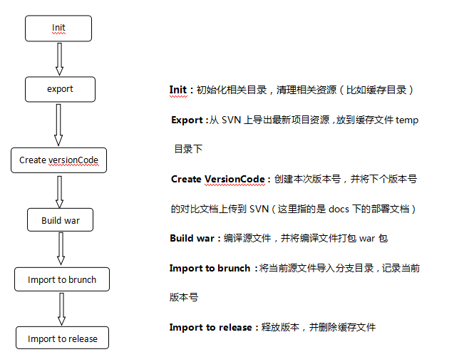

# 使用Ant脚本，自动构建、部署项目

## 前言
为了规范研发流程，避免研发人员重复做无意义的事情，现利用Ant实现全自动化打包功能。开发人员提交代码后，由研发人员（开发或测试）执行脚本便可以自动构建、打包项目并上传到SVN，由测试人员适时部署到测试环境进行测试，测试通过后，可将最终release版本递交给运维正式上线。

## 基本流程

	  
## 运行环境
1、jdk 1.8  
2、Apache ant 1.9.7 （注意配置环境变量）  
3、这里需要用到svn的ant相关工具包、命令支持。需要下载svnant-1.3.1.zip，将里面的lib库放置在ant脚本的编译运行环境中。  
4、生成版本号所用到的类，需要打成jar包(releaseversion.jar)放到antlib中  
5、需要将

## 执行脚本打包项目
1、在运行窗口输入命令cmd，进入docs界面  
2、进入antlib和build脚本所在目录  
3、执行命令：ant -buildfile <build脚本名>，回车即可  
例：ant -buildfile build_AUS.xml  
如果build脚本为默认名称build.xml，则可直接输入命令 ant 回车执行。  

## 备注
VersionTask.java是版本控制的源代码，对应 releaseversion.jar。  
具体项目可根据具体要求，修改版本号的生成规则，然后打成jar包即可。
